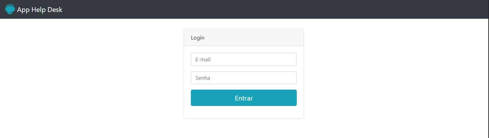
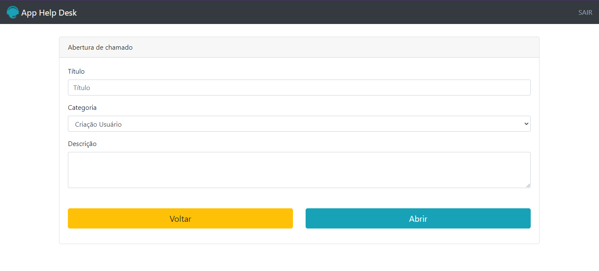

 <h1 align="center">App Help Desk</h1>

  

<!-- ABOUT THE PROJECT -->
## Sobre o projeto
### Tela login

    

### Tela registro

    

### Tela consulta

    

Sistema que pode abrir chamados e consulta-los. Criado controle de acesso onde, caso você seja administrador, você poderá visualizar todos os chamados, caso seu login seja de usuário, você poderá consultar somente os seus chamados.

### Recursos usados

* [PHP](https://www.php.net/)
* [Bootstrap 4](https://getbootstrap.com/)

## Sobre

Projeto desenvolvido totalmente para fins acadêmicos.
